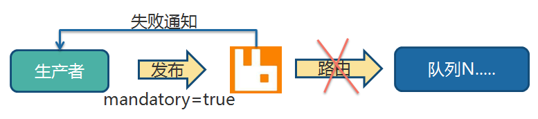
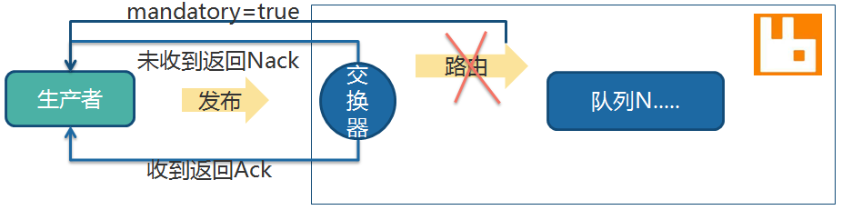
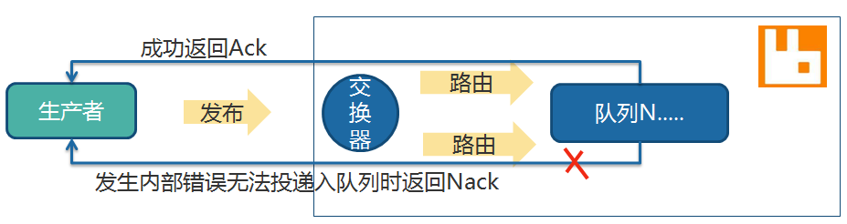

## RabbitMQ 总结

### 1. 容易理解错的坑

在使用原生的 Java 客户端测试时发现，当队列和交换机通过路由键进行绑定时，如果之前已经绑定过了，此次又换了路由键，那么这两个绑定都是存在的，可以通过管理控制台进行查看。收发消息时会发现之前绑定的依然生效，这点需要注意。

队列一般是伴随消费者创建的，生产者只关心交换机和消费者没有任何关系。

声明队列或者交换机时，如果之前已经有同名的则此次直接返回成功，但如果参数有所变化，那么 RabbitMQ 会抛出异常 `channel error; protocol method: #method<channel.close>(reply-code=406, reply-text=PRECONDITION_FAILED`，此时可以通过管理控制台近一步查看具体哪些属性不同，可以选择删除原配置或者新配置的声明改为和原来一致。


### 2. 交换机的差异

direct 是发送方投递消息到交换机， RabbitMQ 根据路由键完全匹配到后会路由到不同的队列，从而消费者就接收到了消息
fanout 是发送方投递消息到交换机， RabbitMQ 直接忽略路由键发送消息到交换机绑定的队列，从而消费者就接收到了消息
topic 可以实现占位符替换的功能， 按照约定的路由键动态配置，具体可参考示例 [topic 交换机](https://github.com/pleuvoir/mq-research/tree/master/source/rabbitmq/rabbitmq-native/src/main/java/io/github/pleuvoir/exchange/topic)

创建持久化交换器，当生产者先发送消息 消费者再上线 则可以接收到以前的消息

### 3. 消息发布时的权衡

#### 失败确认

在发送消息时设置 mandatory 标志，告诉 RabbitMQ，如果消息不可路由，应该将消息返回给发送者，并通知失败。可以这样认为，开启 mandatory 是开启故障检测模式。
注意：它只会让 RabbitMQ 向你通知失败，而不会通知成功。如果消息正确路由到队列，则发布者不会受到任何通知。带来的问题是无法确保发布消息一定是成功的，因为通知失败的消息可能会丢失。



```java
channel.addReturnListener(new ReturnListener() {
	public void handleReturn(int replyCode, String replyText, String exchange, String routingKey,
			AMQP.BasicProperties properties, byte[] body) throws IOException {
		String message = new String(body);
		System.out.println("返回的replyText ：" + replyText);
		System.out.println("返回的exchange ：" + exchange);
		System.out.println("返回的routingKey ：" + routingKey);
		System.out.println("返回的message ：" + message);
	}
});
```

#### 事务

事务的实现主要是对信道（Channel）的设置，主要的方法有三个：

1. channel.txSelect() 声明启动事务模式
2. channel.txCommit() 提交事务
3. channel.txRollback() 回滚事务

以上就完成了事务的交互流程，如果其中任意一个环节出现问题，就会抛出 IoException，这样用户就可以拦截异常进行事务回滚，或决定要不要重复消息。发送消息时开启事务，性能下降严重，大概会降低 2~10 倍的性能。

#### 发送方确认模式

基于事务的性能问题，RabbitMQ 团队为我们拿出了更好的方案，即采用发送方确认模式，该模式比事务更轻量，性能影响几乎可以忽略不计。原理：生产者将信道设置成 confirm 模式，一旦信道进入 confirm 模式，所有在该信道上面发布的消息都将会被指派一个唯一的 ID (从 1 开始)，由这个 ID 在生产者和 RabbitMQ 之间进行消息的确认。

不可路由的消息，当交换器发现，消息不能路由到任何队列，会进行确认操作，表示收到了消息。如果发送方设置了 mandatory 模式,则会先调用 addReturnListener 监听器。



可路由的消息，要等到消息被投递到所有匹配的队列之后，broker 会发送一个确认给生产者(包含消息的唯一 ID)，这就使得生产者知道消息已经正确到达目的队列了，如果消息和队列是可持久化的，那么确认消息会在将消息写入磁盘之后发出，broker 回传给生产者的确认消息中 delivery-tag 域包含了确认消息的序列号。



confirm 模式最大的好处在于他可以是异步的，一旦发布一条消息，生产者应用程序就可以在等信道返回确认的同时继续发送下一条消息，当消息最终得到确认之后，生产者应用便可以通过回调方法来处理该确认消息，如果 RabbitMQ 因为自身内部错误导致消息丢失，就会发送一条 nack 消息，生产者应用程序同样可以在回调方法中处理该 nack 消息决定下一步的处理。

Confirm 三种实现方式：
1. channel.waitForConfirms() 普通 发送方确认模式；消息到达交换器，就会返回true。
2. channel.waitForConfirmsOrDie() 批量确认模式；使用同步方式等所有的消息发送之后才会执行后面代码，只要有一个消息未到达交换器就会抛出IOException异常。
3. channel.addConfirmListener() 异步监听发送方确认模式；

注意：发送方确认模式，生产者无需消费者也是可以确认成功的，所以发送方确认模式和消费者是没有关系的。发送方异步确认模式同样也有批量确认，什么时候确认完全由 RabbitMQ 自己内部决定。

#### 备用交换器

在第一次声明交换器时被指定，用来提供一种预先存在的交换器，如果主交换器无法路由消息，那么消息将被路由到这个新的备用交换器。

如果发布消息时同时设置了 mandatory 会如何？ 如果主交换器无法路由消息，RabbitMQ 并不会通知发布者，因为，向备用交换器发送消息，表示消息已经被路由了。注意，新的备用交换器就是普通的交换器，没有任何特殊的地方。

使用备用交换器，向往常一样，声明 Queue 和备用交换器，把 Queue 绑定到备用交换器上。然后在声明主交换器时，通过交换器的参数，alternate-exchange，将备用交换器设置给主交换器。
建议备用交换器设置为 faout 类型，Queue绑定时的路由键设置为"#"，由于平时不会这么用所以也就没有写示例。


